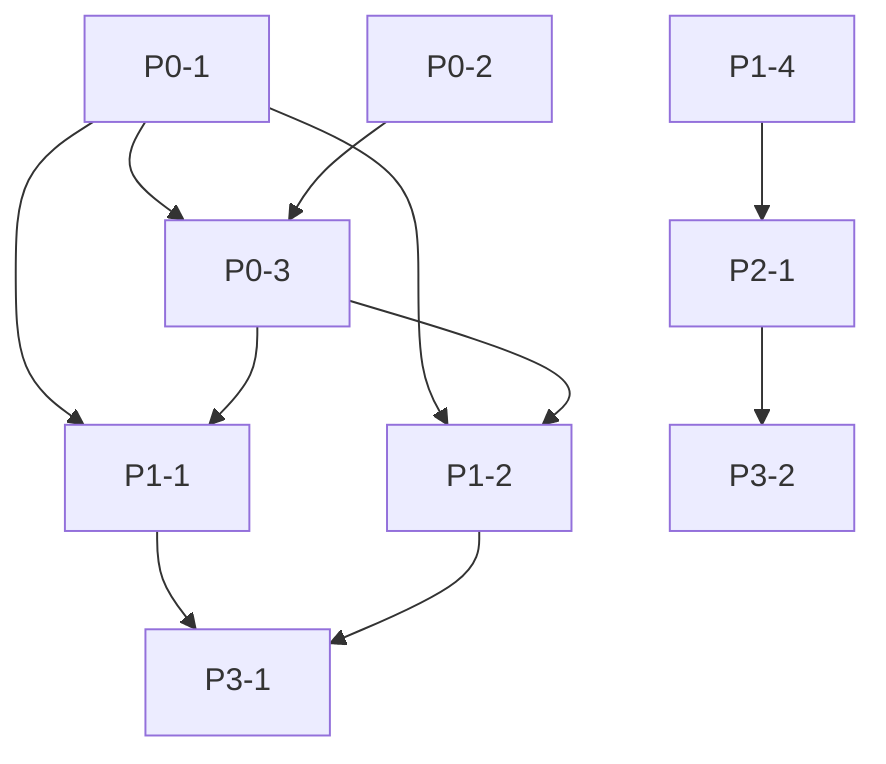

# Hermus Agent Free — Improvement Plan

**Created**: 2026-09-21  
**Status**: DRAFT — awaiting approval before implementation  
**Reality check (2026-09-21)**: P0-1 is already in flight on the working tree
(`core/agent_manager.py` deleted, handlers moved to `core/agent_handlers.py`,
compat facade in `core/fleet/facade.py`, migration scripts staged). The import
migration is **not finished** — see the P0-1 checklist below. No other item has
been started.

**P0 execution status (2026-09-21, later)**:
- **P0-1 ✅ DONE.** All import sites below migrated; role vocabulary rehomed to
  `core/agent_roles.py`; stale tests rewritten against the fleet facade; the
  registry's model path routed through `ModelGateway.llm()` (model-boundary gate
  green). Pinned gate now asserts `agent_manager.py` stays deleted.
- **P0-2 ✅ DONE.** `validate_critical_config()` already existed; wired into the
  gateway lifespan (env opt-out `HERMUS_SKIP_VALIDATION`), `python bootstrap.py
  doctor`, and now also `./hermus doctor` (`--skip-validation` flag added).
  Contract tests added; `tests/conftest.py` opts the suite out.
- **P0-3 ✅ DONE (core).** `map_exception()` added to `core/errors.py` (typed
  passthrough, cause/ExceptionGroup unwrapping, stdlib shapes, HTTP-status
  responses) and wired into the gateway's unhandled-error handler — recognized
  shapes get real status codes, unknown ones stay redacted internal 500s. The
  "replace 50+ bare excepts" sweep is **not** started (needs its own pass).

---

## 📋 Executive Summary

Based on codebase analysis (60+ core modules, 114 test files, ~1.1M test chars), the project has **strong architectural foundations** (Fleet v2 event-sourcing, approval gates, provider abstraction) but carries **technical debt** in large modules and legacy duplication.

**Goal**: Systematic improvements prioritized by impact/risk ratio, with clear acceptance criteria.

---

## 🎯 Improvement Categories

| Category | Count | Risk Level |
|----------|-------|------------|
| P0 — Critical (Legacy removal, safety) | 3 | Low (deletion/refactor) |
| P1 — High Impact (Maintainability) | 4 | Medium (refactor) |
| P2 — Stability (Observability, backpressure) | 3 | Low-Medium |
| P3 — Quality (Types, docs, DX) | 4 | Low |
---

## 📝 Detailed Work Items

### P0 — Critical (Do First)

| ID | Title | Description | Acceptance Criteria | Effort | Dependencies |
|----|-------|-------------|---------------------|--------|--------------|
| **P0-1** | Remove `core/agent_manager.py` legacy registry | 🟡 **IN FLIGHT.** File deleted; roster lives in `core.fleet.registry.FleetRegistry`; `core.fleet.facade` keeps a drop-in compat surface. Remaining: migrate the import sites listed below, then remove the compat surface. The registry.py docstring's rule stands: *"duplicate/split-brain registries are merged onto it and never re-implemented next to it"* | - Import sites below migrated - `make test` green - No `core.agent_manager` imports left | 4h | None |
| **P0-2** | Startup config validation | Add `validate_critical_config()` in `bootstrap.py` that checks: Ollama reachable when model=ollama/*, max_tool_steps ≥ 8, required directories writable, port 8000 free. Fail fast with actionable messages. | - Runs on `python hermus.py doctor` and gateway startup - Clear error messages for each failure mode - `--skip-validation` flag for CI | 2h | None |
| **P0-3** | Standardize error handling | Replace 50+ bare `except Exception:` patterns with typed `HermusError` hierarchy from `core/errors.py`. Add `map_exception(exc) -> HermusError` utility. | - All routes return `envelope.py` format - `retryable`, `user_message`, `code` fields present - `core/errors.py` exports cover all failure modes | 6h | P0-1 |

---

**P0-1 remaining import sites** — ✅ **ALL MIGRATED** (verified 2026-09-21):
`gateway/gateway.py`, `gateway/handlers.py`, `gateway/routes_subsystems.py`,
`gateway/routes_jarvis.py`, `core/console.py`, `core/agent_handlers.py`,
`core/fleet/facade.py`, and the four test files now all use the fleet facade /
`core.agent_roles`. Zero `core.agent_manager` imports remain.

### P1 — High Impact (Maintainability)

| ID | Title | Description | Acceptance Criteria | Effort | Dependencies |
|----|-------|-------------|---------------------|--------|--------------|
| **P1-1** | Extract `ToolExecutor` from `core/agent.py` | `agent.py` (65KB) does: model calls, tool execution, memory, trajectory, budget governance. Split into `AgentCore` (orchestration) + `ToolExecutor` (tool loop, approval, retries) + `MemoryMixin`. | - `core/agent.py` < 30KB - `ToolExecutor` unit-testable in isolation - No behavior change (verified by existing tests) | 8h | P0-1 |
| **P1-2** | Extract `StepExecutor` from `core/runtime.py` | `runtime.py` (35KB) mixes mission lifecycle, step execution, budget governance. Split `StepExecutor` (single turn) from `MissionRuntime` (multi-turn orchestration). | - `runtime.py` < 20KB - `StepExecutor` reusable for chat/agent modes - Mission tests pass | 8h | P0-1 |
| **P1-3** | WebSocket backpressure for Fleet WS | In `routes_fleet.py::_fleet_ws_poll_and_send()`: add send timeout, client queue depth tracking, drop stale events when client lags >5s. | - No memory leak on slow clients - `test_fleet_ws_connect` passes under load - Metrics: `ws_send_timeout_total`, `ws_dropped_events_total` | 4h | None |
| **P1-4** | Connection pooling for SQLite | `memory2.py` opens raw `sqlite3.connect()` per operation. Add `aiosqlite` pool (or `SQLAlchemy` async engine) with configurable pool size. | - `memory2.py` uses pool - No connection leaks under load - Benchmark: 2x throughput on concurrent recalls | 6h | None |
---

### P2 — Stability (Observability, Reliability)

| ID | Title | Description | Acceptance Criteria | Effort | Dependencies |
|----|-------|-------------|---------------------|--------|--------------|
| **P2-1** | Prometheus metrics | Add `core/metrics.py` with: `hermus_agent_turns_total`, `hermus_tool_latency_seconds`, `hermus_fleet_agents_active`, `hermus_mission_duration_seconds`. Expose `/metrics` on gateway. | - `/metrics` returns Prometheus format - All fleet/agent/mission paths instrumented - Grafana dashboard JSON in `docs/ops/` | 4h | P1-4 |
| **P2-2** | Rate limiting on fleet APIs | Add token-bucket limiter on `/api/fleet/*` (configurable: default 60 req/min per token). Return 429 with `Retry-After`. | - `test_routes_fleet_*` pass with limiter enabled - Config: `HERMUS_FLEET_RATE_LIMIT_RPM` - Dashboard shows limit headers | 3h | None |
| **P2-3** | Request size limits & CSP | `GZipMiddleware` is already present; add `max_body_size` on upload endpoints; add CSP header on `/control` (script-src 'self'; object-src 'none'). | - Upload endpoints reject >10MB with 413 - `/control` has CSP header - Security headers test in CI | 2h | None |

---

### P3 — Quality (Types, DX, Docs)

| ID | Title | Description | Acceptance Criteria | Effort | Dependencies |
|----|-------|-------------|---------------------|--------|--------------|
| **P3-1** | Expand mypy strict coverage | Enable `disallow_untyped_defs=true` for: `core.agent`, `core.runtime`, `gateway.*`, `core.fleet.*`. Fix resulting errors. | - `make typecheck-full` passes - No `Any` in public APIs - Type coverage > 80% | 8h | P0-3, P1-1, P1-2 |
| **P3-2** | Benchmark + CI | The repo currently has **no** GitHub Actions workflows. Add `.github/workflows/test.yml` (the README badge assumes it) and `.github/workflows/bench.yml`: run `make test` + `make bench-json` on PR, compare to main, fail if >10% regression on p95 latency. | - Runs on every PR - Posts comment with comparison - Stores history for trend | 3h | P2-1 |
| **P3-3** | Document all env vars | `.env.example` **does not exist today** — create it from `core/config.py` (every `Field(validation_alias=...)` plus the `HERMUS_` env-prefix defaults), grouped by category with descriptions, defaults, valid ranges. | - `.env.example` covers 100% of `validation_alias` fields - Sorted by category - `make docs-env-check` target validates sync | 3h | None |
| **P3-4** | Dashboard UX polish | Add: Cmd+K command palette, WS reconnection badge, agent detail modal, token usage sparklines, keyboard shortcuts help (Shift+?). | - No JS errors in console - Works on mobile viewport - Accessibility: ARIA labels, focus management | 6h | P1-3 |

---

## 🔗 Dependency Graph

**Critical Path**: P0-1 → P0-3 → P1-1/P1-2 → P3-1 (≈ 26h sequential)

---

## ✅ Success Metrics

| Metric | Current | Target | Measurement |
|--------|---------|--------|-------------|
| Legacy files | 0 on disk (`agent_manager.py` deleted) — imports remain | 0 imports | `grep -r "core.agent_manager" --include="*.py"` |
| Largest module | 65KB (`agent.py`) | <30KB | `wc -c core/agent.py` |
| Type coverage (strict) | 2 modules | 10+ modules | `make typecheck-full` |
| Fleet test pass rate | 92.6% | 100% | `pytest tests/test_routes_fleet_*` |
| Startup validation | None | Fail-fast | `python hermus.py doctor` |
| Metrics endpoint | None | `/metrics` | `curl /metrics` |

---

## 🗓️ Suggested Sprint Plan

| Sprint | Focus | Items | Est. Hours |
|--------|-------|-------|------------|
| **Sprint 1** | Foundation | P0-1, P0-2, P0-3 | 12h |
| **Sprint 2** | Core refactor | P1-1, P1-2 | 16h |
| **Sprint 3** | Stability | P1-3, P1-4, P2-1, P2-2, P2-3 | 19h |
| **Sprint 4** | Quality | P3-1, P3-2, P3-3, P3-4 | 20h |

**Total**: ~67 hours over 4 sprints (adjustable based on capacity)

---

## ❓ Questions for Approval

1. **Scope**: Proceed with all P0 items first? (Recommended: yes — they're low-risk, high-value)
2. **P1-1/P1-2 ordering**: Extract `ToolExecutor` first (P1-1) or `StepExecutor` (P1-2)? Both independent after P0-1.
3. **P2-1 metrics**: Prometheus vs custom `/metrics` JSON? Prometheus is standard but adds dependency.
4. **P3-4 dashboard**: Priority vs backend work? Can parallelize with frontend-focused contributor.
5. **Breaking changes**: Any API changes need versioning strategy? (Current: none planned)

---

## 🚀 Next Steps (After Approval)

1. **Create GitHub Issues** for each work item with labels: `p0`, `p1`, `p2`, `p3`, `backend`, `frontend`, `infra`
2. **Branch strategy**: `improve/<id>-<slug>` (e.g., `improve/p0-1-remove-agent-manager`)
3. **PR template**: Link to this plan, require test pass + typecheck + benchmark
4. **Retrospective**: After Sprint 1, reassess priorities based on learnings

---

## 📋 Approval

**Approval**: ✅ / ❌ / 🔄 (with comments)

*Plan author: AI Assistant — ready to execute on approval*